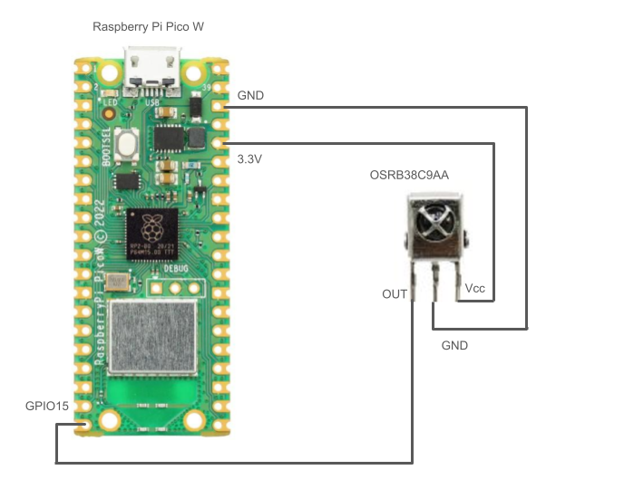
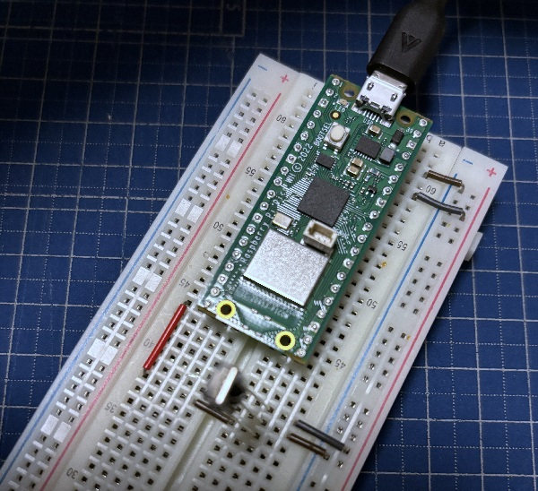
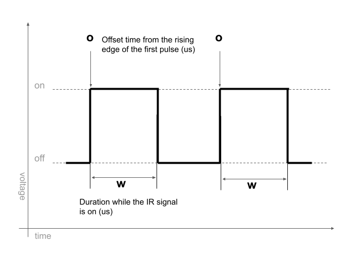

# IR Signal Scanner for SwitchBot Hub Mini  
This project was created to analyze and report the IR signal output of the Hub Mini to the SwitchBot development team.  

## Devices  
- Raspberry Pi Pico W  
- OSRB38C9AA  

  
  

## Dump Data  
The success data, error data, and original remote controller data can be found in `/tools/samples/`.  
Dump data is recorded in the format `o: 73153/w: 452`.  
- `o`: The offset time from the rising edge of the first pulse (in microseconds).  
- `w`: The duration while the IR signal is on (in microseconds).  

  